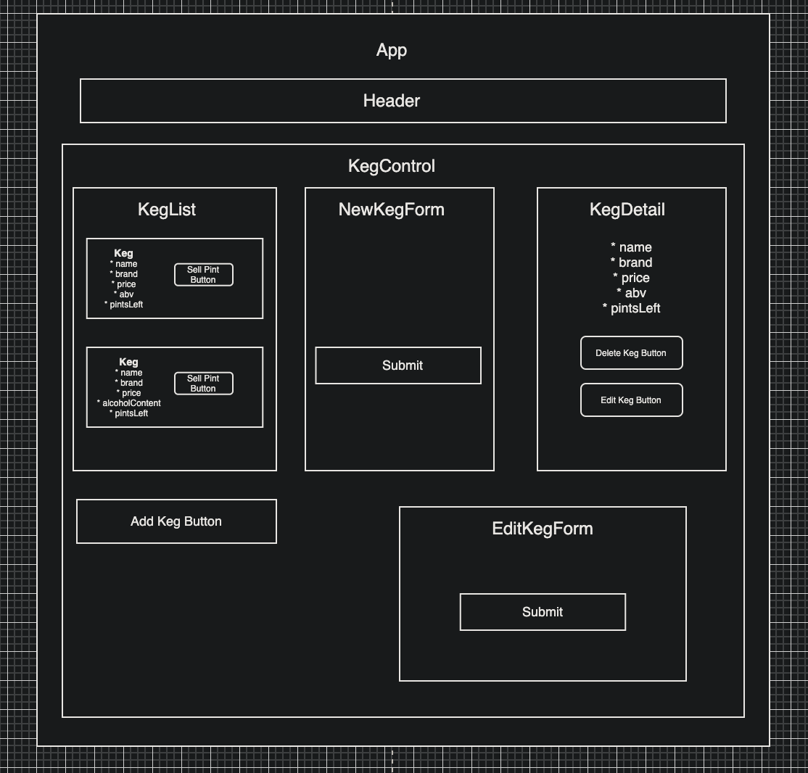

# Hip Hops Tap Room

<h3 align="center">React Fundamentals | Initialized: 02-12-2021</h3>
<h4 align="center"> By Agata Kolodziej</h4>

## Description

Thirteenth independent project for Epicodus to demonstrate my understanding of React Fundamentals. This is a basic React application that uses local and shared state with full CRUD functionality. I created the skeleton of the React app by using `create-react-app`. Project design was structured based on functional and class components. Components were built using JSX. This is a Keg Tracker app for "Hip Hops", a hip hop themed brewery. A user can create a keg, read all kegs created in a list, view keg details, "buy pints"/decrease the pint quantity of the keg, update keg details, and delete a keg.

## Component Diagram

## User Stories

  
Expand

- As a user, I want to see a list/menu of all available kegs. For each keg, I want to see its name, brand, price and alcoholContent (or perhaps something like flavor for a kombucha store).
- As a user, I want to submit a form to add a new keg to a list.
- As a user, I want to be able to click on a keg to see its detail page.
- As a user, I want to see how many pints are left in a keg. Hint: A full keg has roughly 124 pints.
- As a user, I want to be able to click a button next to a keg whenever I sell a pint of it. This should decrease the number of pints left by 1. Pints should not be able to go below 0.

##### Software Requirements

1. Internet browser
2. A code editor such as VSCode to view and edit the code

##### Open Locally

- Click on the link to my repository: [My Repository](https://github.com/agatakolohe/TapRoom.git)
- Click on the green "Code" button and copy the repository URL
- Open your terminal and use the command `git clone https://github.com/agatakolohe/TapRoom.git` into the directory you would like to clone the repository
- Open in text editor to view code and make changes
  - Open terminal and navigate to tap-room directory
  - Use the command `npm install` to download and install all necessary packages for the project to function

Getting Started with Create React App

This project was bootstrapped with [Create React App](https://github.com/facebook/create-react-app).

## Available Scripts

In the project directory, you can run:

### `npm start`

Runs the app in the development mode.\
Open [http://localhost:3000](http://localhost:3000) to view it in the browser.

The page will reload if you make edits.\
You will also see any lint errors in the console.

### `npm test`

Launches the test runner in the interactive watch mode.\
See the section about [running tests](https://facebook.github.io/create-react-app/docs/running-tests) for more information.

### `npm run build`

Builds the app for production to the `build` folder.\
It correctly bundles React in production mode and optimizes the build for the best performance.

The build is minified and the filenames include the hashes.\
Your app is ready to be deployed!

See the section about [deployment](https://facebook.github.io/create-react-app/docs/deployment) for more information.

### `npm run eject`

**Note: this is a one-way operation. Once you `eject`, you can’t go back!**

If you aren’t satisfied with the build tool and configuration choices, you can `eject` at any time. This command will remove the single build dependency from your project.

Instead, it will copy all the configuration files and the transitive dependencies (webpack, Babel, ESLint, etc) right into your project so you have full control over them. All of the commands except `eject` will still work, but they will point to the copied scripts so you can tweak them. At this point you’re on your own.

You don’t have to ever use `eject`. The curated feature set is suitable for small and middle deployments, and you shouldn’t feel obligated to use this feature. However we understand that this tool wouldn’t be useful if you couldn’t customize it when you are ready for it.

## Learn More

You can learn more in the [Create React App documentation](https://facebook.github.io/create-react-app/docs/getting-started).

To learn React, check out the [React documentation](https://reactjs.org/).

### Code Splitting

This section has moved here: [https://facebook.github.io/create-react-app/docs/code-splitting](https://facebook.github.io/create-react-app/docs/code-splitting)

### Analyzing the Bundle Size

This section has moved here: [https://facebook.github.io/create-react-app/docs/analyzing-the-bundle-size](https://facebook.github.io/create-react-app/docs/analyzing-the-bundle-size)

### Making a Progressive Web App

This section has moved here: [https://facebook.github.io/create-react-app/docs/making-a-progressive-web-app](https://facebook.github.io/create-react-app/docs/making-a-progressive-web-app)

### Advanced Configuration

This section has moved here: [https://facebook.github.io/create-react-app/docs/advanced-configuration](https://facebook.github.io/create-react-app/docs/advanced-configuration)

### Deployment

This section has moved here: [https://facebook.github.io/create-react-app/docs/deployment](https://facebook.github.io/create-react-app/docs/deployment)

### `npm run build` fails to minify

This section has moved here: [https://facebook.github.io/create-react-app/docs/troubleshooting#npm-run-build-fails-to-minify](https://facebook.github.io/create-react-app/docs/troubleshooting#npm-run-build-fails-to-minify)

#### View In Browser

- To Build and view in browser
  - Navigate to tap-room directory and use the command `npm start`
  - Enjoy the application!

## Known Bugs

No known bugs

## Support and Contact Details

You can use console.log() statements and `debugger` to debug React applications. [React Developer Tools](https://react-devtools-tutorial.now.sh/) is available for both [Chrome](https://chrome.google.com/webstore/detail/react-developer-tools/fmkadmapgofadopljbjfkapdkoienihi?hl=en) and Firefox. If any errors or bugs occur please email me, <agatakolohe@gmail.com>.

## Technologies Used

- CSS
- Babel
- Bootstrap
- `npx create-react-app`
- Git | GitHub
- JavaScript ES6
- JSX
- Node
- npm
- React
- VS Code
- webpack

### License

This software is licensed under the [MIT License](https://choosealicense.com/licenses/mit/).

Copyright (c) 2021 Agata Kolodziej 
